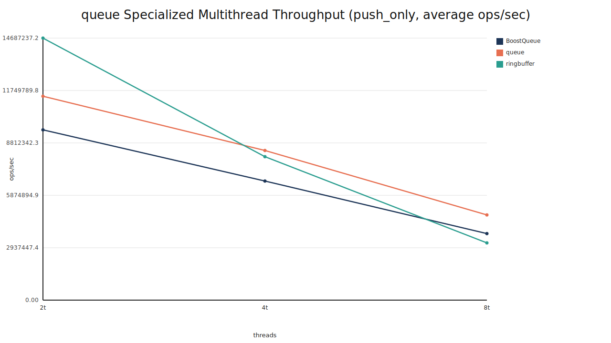
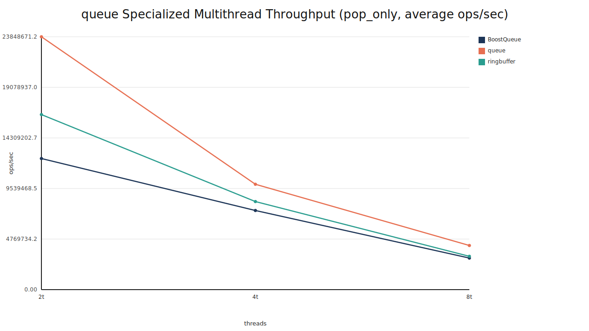
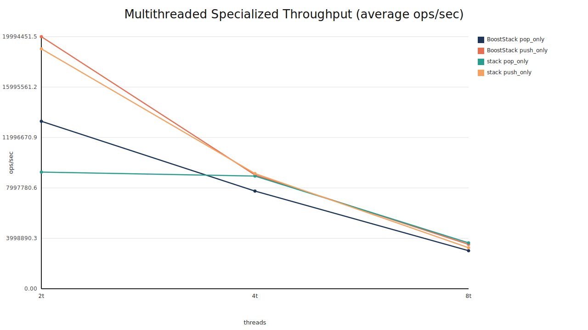

# Seraph

Seraph is a C++ data-structure library for Apple ARM64.

## Why Seraph

[1–2 sentences on the problem Seraph solves and who it is for.]

## Key Features

- [Feature 1: concrete capability]
- [Feature 2: concrete capability]
- [Feature 3: concrete capability]
- [Feature 4: concrete capability]

## Design Highlights

- [Design choice 1 and why it exists]
- [Design choice 2 and why it exists]
- [Concurrency or memory-model note]

## Implementation Notes

- `queue` is a Michael–Scott lock‑free list; linearizability is enforced via CAS on `head/tail` and hazard pointers provide a safe memory‑reclamation scheme under the C++ atomics model.
- `stack` is a two‑phase system: a mutexed vector for low contention, then a Treiber‑style CAS list after a contention‑streak threshold (a simple stochastic estimator that avoids premature promotion).
- `RingBuffer` uses power‑of‑two capacity with sequence numbers as a monotone counter on `Z`, so slot state is tracked by congruence classes; a mirrored index set (size `2N`) makes `back()` a linear scan without modular wrap branches.
- Cache‑line alignment reduces false sharing; per‑slot reader counts create a bounded critical section for peeks so `front/back` remain wait‑free with respect to the pop’s move/reset.

## Correctness & Safety

- [Testing strategy or invariants]
- [Sanitizers / tooling]
- [Known constraints]

The specs of the machine (Macbook M4 Pro) optimized for are as follows:

- **L1 instruction cache size**: 128 KB
- **L1 data cache size**: 64 KB
- **L2 cache size**: 4 MB

The structures are tuned for 4-thread workloads.

## Project Layout

- `include/seraph/stack.hpp`: stack API skeleton
- `include/seraph/queue.hpp`: queue API skeleton
- `tests/basic_compile_test.cpp`: basic compile/link smoke test
- `src/`: implementation files (minimal scaffold)
- `VERSION`: package semantic version (`MAJOR.MINOR.PATCH`)

## Performance Highlights

I compared Seraph to [`Boost`](https://www.boost.org/)’s lock‑free containers because they are commonly used in performance‑critical C++ code.

Specialized multithread throughput (ops/sec), Release build, 2/4/8 threads, 5 repeats (`queue`: 200k ops/thread, `stack`: 150k ops/thread):





## Performance Summary

Queue: Seraph `queue` leads pop‑only throughput across 2/4/8 threads (~23.8M / 9.9M / 4.16M ops/sec), while push‑only is led by `ringbuffer` at 2 threads (~14.7M ops/sec) and by `queue` at 4/8 threads (~8.4M / 4.8M ops/sec).

Stack: Seraph is competitive with Boost—`stack` leads at 4 threads for both push/pop (~9.1M / 8.9M ops/sec), while Boost edges at 2 threads and is slightly ahead at 8 threads.

## Benchmark Methodology

- Build: Release (`-DCMAKE_BUILD_TYPE=Release`)
- Threads: 2, 4, 8
- Repeats: 5
- Queue ops/thread: 200k
- Stack ops/thread: 150k
- Warm-up: none (each repeat runs without an explicit warm-up phase)
- Boost comparisons: enabled when Boost headers are found (CMake `find_package(Boost)` or `/opt/homebrew/include/boost`)

## Reproduce Results

- `cmake -S . -B build -DCMAKE_BUILD_TYPE=Release`
- `cmake --build build --target seraph_queue_perf seraph_stack_perf`
- `./build/seraph_queue_perf`
- `./build/seraph_stack_perf`

## Limitations

- [Portability or architecture constraints]
- [Performance caveats]
- [Concurrency or workload assumptions]

## Roadmap

- [Short-term item]
- [Medium-term item]
- [Long-term item]

## Usage Examples

Queue:

```cpp
// [Minimal queue example]
```

Stack:

```cpp
// [Minimal stack example]
```


## Build Locally

```bash
cmake -S . -B build -DCMAKE_BUILD_TYPE=Debug
cmake --build build
ctest --test-dir build --output-on-failure
```

## Consumer Usage

### Option 1: add_subdirectory (local checkout)

```cmake
add_subdirectory(path/to/Seraph)
target_link_libraries(my_app PRIVATE seraph::seraph)
```

### Option 2: FetchContent (remote source)

```cmake
include(FetchContent)
FetchContent_Declare(
  seraph
  GIT_REPOSITORY https://github.com/<you>/Seraph.git
  GIT_TAG main
)
FetchContent_MakeAvailable(seraph)
target_link_libraries(my_app PRIVATE seraph::seraph)
```

### Option 3: Installed package (find_package)

Install Seraph:

```bash
cmake -S . -B build -DCMAKE_BUILD_TYPE=Release
cmake --build build
cmake --install build --prefix "$HOME/.local"
```

Use in another project:

```cmake
find_package(seraph CONFIG REQUIRED)
target_link_libraries(my_app PRIVATE seraph::seraph)
```

## Formatting

```bash
cmake --build build --target format
```

## Notes

- TODO markers in headers and tests identify the next implementation steps.
